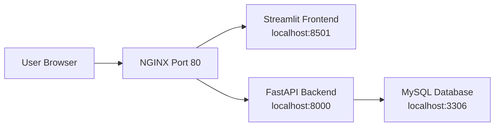

# Portfolio Quant Project Deployment Process

## 1. Project Goal

This document describes a simple and scalable deployment approach for the Portfolio Quant project using:
- Streamlit frontend for the user interface
- FastAPI backend for business logic and APIs
- MySQL database for storing portfolio and stock data
- NGINX as the public entry point for traffic routing

The deployment model is designed for a minimal initial setup while remaining ready for future scaling.

---

## 2. Proposed Deployment Architecture

### Current Minimal Deployment Model

- One server hosts all components
- Public traffic enters through NGINX on port 80
- NGINX forwards requests to:
  - Frontend on localhost:8501
  - Backend on localhost:8000
  - Database on localhost:3306

### Architecture Overview



### Design Principles

- Single-user / minimal deployment first
- Low cost and easy maintenance
- One UI entry point for users
- Backend and database kept behind a single internal service layer
- Easy to expand later into multiple instances and regions

---

## 3. Deployment Components

### Frontend
- Built with Streamlit
- Handles dashboard visualization and user interaction
- Exposed through NGINX for public access

### Backend
- Built with FastAPI
- Exposes REST APIs for users, portfolios, holdings, stocks, and transactions
- Communicates with the database

### Database
- MySQL database stores portfolio-related records
- Must be initialized with schema and seed data before backend use

### Reverse Proxy
- NGINX receives public requests on port 80
- Routes requests to frontend and backend services
- Improves structure, security, and future scaling

---

## 4. Deployment Process

### Step 1: Provision the Server
- Prepare a Linux-based server or VPS
- Install required system packages:
  - Python 3.10+
  - pip
  - virtualenv
  - MySQL Server
  - NGINX
  - Git

### Step 2: Clone the Project
```bash
git clone <repository-url>
cd <project-folder>
```

### Step 3: Create Python Environment
```bash
python3 -m venv venv
source venv/bin/activate
pip install -r requirements.txt
```

### Step 4: Install and Configure MySQL
- Install MySQL Server
- Create the database
- Set up user credentials
- Configure the application environment variables

Example environment variables:
```bash
export DB_HOST=localhost
export DB_PORT=3306
export DB_USER=root
export DB_PASSWORD=your_password
export DB_NAME=portfolio_db
```

### Step 5: Initialize Database Schema
Run the database setup scripts:
```bash
cd portfolio_db_setup
python create_database.py
python seed_user.py
python seed_top_stocks.py
```

### Step 6: Start the Backend
```bash
cd backend
uvicorn main:app --host 0.0.0.0 --port 8000
```

### Step 7: Start the Frontend
```bash
cd frontend
streamlit run app.py --server.port 8501 --server.address 0.0.0.0
```

### Step 8: Configure NGINX
Create an NGINX server block to route traffic:
- Port 80 receives external requests
- Requests to `/` go to the Streamlit app
- Requests to `/api/` go to the FastAPI backend

Example flow:
- Public URL -> NGINX
- NGINX -> Frontend (8501)
- NGINX -> Backend (8000)

### Step 9: Enable HTTPS (Recommended)
- Use Certbot with Let’s Encrypt
- Secure the public deployment endpoint
- Redirect HTTP traffic to HTTPS

---

## 5. Service Management

To keep the deployment running reliably, use process managers such as:
- systemd
- supervisor
- pm2 (for Node-style services, if applicable)

Recommended approach:
- Backend managed as a service
- Frontend managed as a service
- NGINX remains always running

---

## 6. Monitoring and Maintenance

### Monitoring Points
- Backend health endpoint
- Frontend availability
- Database connection health
- NGINX access and error logs

### Recommended Checks
- Verify `/health`
- Verify `/api/v1/users`
- Confirm Streamlit loads successfully
- Check database connectivity regularly

### Backup Strategy
- Regular MySQL backups
- Keep code and configuration under version control
- Maintain environment variable backups securely

---

## 7. Scaling Roadmap

### Phase 1: Single Server Deployment
- One server
- All services on one machine
- Suitable for demo, testing, or small-user deployment

### Phase 2: Two-Instance Safe Model
- One instance for UI/frontend
- One instance for backend + database
- Improves separation and stability
- Backend remains a single point of exposure internally

### Phase 3: Distributed Scaling
- Deploy multiple backend instances behind a load balancer
- Use replicated or partitioned databases
- Support regional deployment and disaster recovery

### Future Scalability Model
- Frontend instances can be publicly exposed through multiple aliases or CDN-backed endpoints
- Backend instances can be replicated across regions
- Database can be horizontally partitioned by region or workload

---

## 8. Security Considerations

- Use strong passwords for MySQL and application credentials
- Restrict database access to internal services only
- Enable firewall rules for allowed ports only
- Use HTTPS for public access
- Keep secrets in environment variables or secure secret managers
- Limit exposed service ports

---

## 9. Summary

The project can be deployed in a simple and professional way using:
- Streamlit for the UI
- FastAPI for the backend
- MySQL for storage
- NGINX for public traffic routing

This approach gives a strong foundation for:
- Early deployment
- Demo readiness
- Safe production rollout
- Future horizontal scaling and regional expansion

---

## 10. Suggested PPT Slide Structure

1. Title: Portfolio Quant Deployment Overview
2. Problem Statement and Objectives
3. Proposed Architecture Diagram
4. Deployment Components
5. Step-by-Step Deployment Process
6. Service Management and Monitoring
7. Security and Backup Strategy
8. Scaling Roadmap
9. Benefits and Conclusion
